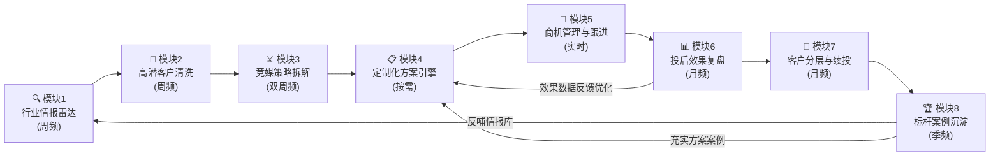
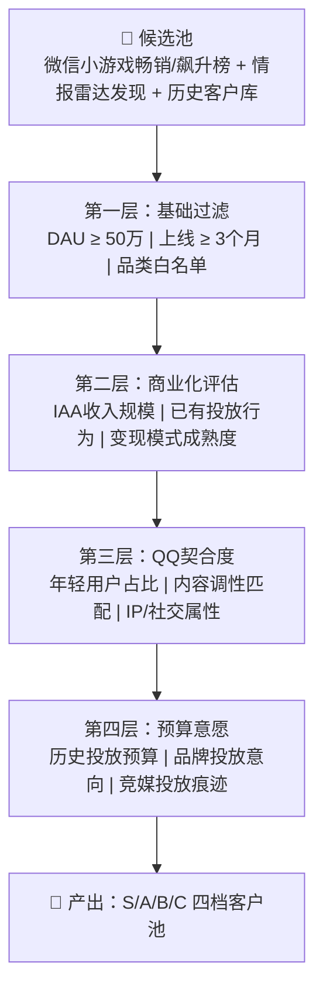
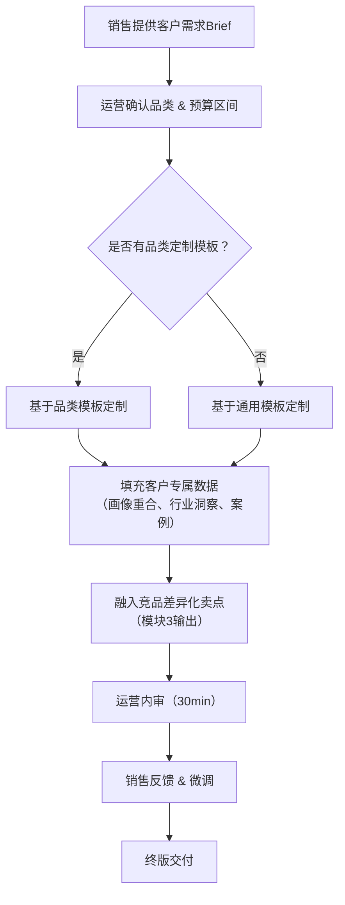
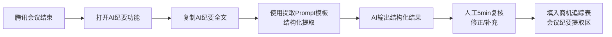

# QQ媒体 × 微信小游戏 品牌效果售卖工作流 SOP

> **版本**：v1.0 | **更新日期**：2026-03-28 | **适用团队**：非微信流量游戏行业运营组（2-3人）

---

## 目录

1. [全局架构与闭环逻辑](#1-全局架构与闭环逻辑)
2. [团队角色分工矩阵](#2-团队角色分工矩阵)
3. [模块1：行业情报雷达](#3-模块1行业情报雷达)
4. [模块2：高潜客户清洗](#4-模块2高潜客户清洗)
5. [模块3：竞媒策略拆解](#5-模块3竞媒策略拆解)
6. [模块4：定制化方案引擎](#6-模块4定制化方案引擎)
7. [模块5：商机管理与跟进](#7-模块5商机管理与跟进)
8. [模块6：投后效果复盘与ROI追踪](#8-模块6投后效果复盘与roi追踪)
9. [模块7：客户分层运营与续投策略](#9-模块7客户分层运营与续投策略)
10. [模块8：标杆案例沉淀与知识库](#10-模块8标杆案例沉淀与知识库)
11. [执行节奏总览](#11-执行节奏总览)
12. [模板迭代与质量保障](#12-模板迭代与质量保障)

---

## 1. 全局架构与闭环逻辑

### 1.1 系统定位

本工作流是一套面向「QQ媒体 × 微信小游戏」垂直赛道的 **商业化运营作战系统**，核心解决三个问题：

1. **发现谁**（模块1-2）：从行业情报中锁定高潜客户
2. **怎么打**（模块3-4）：基于竞品洞察输出差异化方案
3. **如何赢**（模块5-8）：从商机跟进到投后复盘的完整闭环

### 1.2 八模块闭环流转图



### 1.3 数据流转逻辑

| 上游模块 | 输出物 | 下游模块 | 用途 |
|----------|--------|----------|------|
| 模块1 情报雷达 | 行业趋势周报、新锐游戏清单 | 模块2 客户清洗 | 补充潜在客户池 |
| 模块2 客户清洗 | S/A级高潜客户名单 | 模块4 方案引擎、模块5 商机管理 | 定向出方案、建立商机 |
| 模块3 竞媒分析 | 差异化优势点、可借鉴打法 | 模块4 方案引擎 | 方案中融入差异化卖点 |
| 模块4 方案引擎 | 定制化营销方案PPT | 模块5 商机管理 | 销售提案使用 |
| 模块5 商机管理 | 签约客户信息、投放Brief | 模块6 投后复盘 | 建立效果追踪基线 |
| 模块6 投后复盘 | ROI报告、优化建议 | 模块4/7 | 方案迭代、客户分层依据 |
| 模块7 客户分层 | 客户价值评估、续投计划 | 模块5 商机管理 | 续投商机推进 |
| 模块8 案例沉淀 | 标杆案例库 | 模块1/4 | 情报补充、方案案例引用 |

---

## 2. 团队角色分工矩阵

### 2.1 角色定义

| 角色 | 职能定位 | 核心产出 |
|------|----------|----------|
| **运营（主力）** | 情报采集、客户筛选、竞品分析、方案制作、效果复盘、案例沉淀 | 周报、客户清单、方案PPT、复盘报告 |
| **销售** | 商机跟进、客户关系维护、需求收集、客户分层运营 | 会议纪要、商机记录、签约推进 |

### 2.2 模块责任矩阵（RACI）

| 模块 | 运营 | 销售 | 说明 |
|------|------|------|------|
| M1 行业情报雷达 | **R**（负责执行） | I（知晓） | 运营主导采集，通过企微群同步销售 |
| M2 高潜客户清洗 | **R** | C（咨询确认） | 运营初筛，销售确认优先级排序 |
| M3 竞媒策略拆解 | **R** | I | 运营主导，产出供销售了解竞品话术 |
| M4 定制化方案引擎 | **R** | C | 销售提供客户需求输入，运营出方案 |
| M5 商机管理与跟进 | C | **R** | 销售主导跟进，运营协助方案调整 |
| M6 投后效果复盘 | **R** | C | 运营主导数据分析，销售提供客户反馈 |
| M7 客户分层与续投 | C | **R** | 销售主导客户运营，运营提供数据支持 |
| M8 标杆案例沉淀 | **R** | C | 运营主导归档，销售提供一线素材 |

### 2.3 周度协作节奏

| 时间 | 事项 | 参与人 | 产出物 |
|------|------|--------|--------|
| 每周一上午 | 企微群资讯快报推送 | 运营 → 全团队 | 资讯快报（企微群消息） |
| 每周二下午 | 情报周报 & 客户清单同步 | 运营 → 销售 | 周报 + 高潜客户名单 |
| 每周四下午 | 商机进展同步会（15min） | 运营 + 销售 | 商机看板更新 |
| 每双周五上午 | 竞品分析 & 方案复盘 | 运营 + 销售 | 竞品分析更新 + 方案优化建议 |
| 每月最后周五 | 月度复盘会（30min） | 运营 + 销售 | 月报 + 客户分层更新 |

---

## 3. 模块1：行业情报雷达

### 3.1 模块概览

| 维度 | 内容 |
|------|------|
| **目标** | 持续追踪微信小游戏行业动态，第一时间捕捉营销创新玩法和高潜客户信号 |
| **核心KPI** | ①每周产出1份情报周报；②每周企微群推送1份资讯快报；③月度情报命中率（情报→实际商机转化）≥15% |
| **执行节奏** | 周频（每周一推快报，每周二出周报） |
| **主责** | 运营 |

### 3.2 执行步骤

#### Step 1：信息采集（每日碎片化 + 周末集中整理）

**信息源清单：**

| 信息源类型 | 具体渠道 | 采集频率 | 采集方式 |
|------------|----------|----------|----------|
| 内部数据 | DataTalk BI看板 — 小游戏品类趋势、投放数据 | 每周一次 | 登录查看，截图关键数据 |
| 行业榜单 | 微信小游戏畅销榜/飙升榜、阿拉丁指数 | 每周一次 | 手动检索，记录TOP变化 |
| 媒体资讯 | 游戏葡萄、GameLook、白鲸出海、36氪游戏版块 | 每日浏览 | RSS/微信公众号推送，标记相关文章 |
| 社交媒体 | 微博/即刻/知乎相关话题 | 每日碎片化 | 关键词搜索，捕捉热点 |
| 竞品动态 | 抖音小游戏中心、快手小游戏、支付宝小游戏 | 每周一次 | 直接浏览各平台，记录新增合作案例 |
| 行业报告 | Quest Mobile、易观、伽马数据 | 月度 | 下载最新报告，提取关键洞察 |

#### Step 2：企微群资讯快报推送（每周一上午）

> **前置环节——确保团队和干系人第一时间同步行业动态**

**操作流程：**
1. 从本周采集素材中，筛选 **3-5条最具价值** 的资讯
2. 按「企微群资讯快报模板」格式化每条资讯：一句话简报 + 深度解读 + 原文链接
3. 附上「本周趋势总结」（2-3句话概括行业风向）
4. 复制到企微群发送

**标准交付物：** `04_辅助工具/企微群资讯快报模板.md`

#### Step 3：情报结构化录入（每周二上午）

将本周采集的所有情报，按标准化字段录入「行业情报周报模板」：

| 字段 | 说明 |
|------|------|
| 日期 | 资讯发布/发现日期 |
| 来源 | 信息渠道 |
| 案例/资讯名称 | 标题 |
| 涉及游戏 | 相关小游戏名称 |
| 涉及媒体 | 合作媒体平台 |
| 游戏品类 | 休闲/SLG/模拟经营/卡牌/... |
| 营销玩法类型 | 品牌联动/效果广告/达人合作/IP联名/... |
| 关键洞察 | 1-2句话提炼核心看点 |
| 与QQ关联度 | 高/中/低 — 是否可直接借鉴或启发QQ营销方案 |
| 备注 | 详细链接、截图等补充信息 |

#### Step 4：趋势分析与周报输出（每周二下午）

基于本周情报，完成周报中的「趋势汇总」部分：
- 按品类维度：哪些品类本周动作频繁？
- 按媒体维度：哪些平台在发力小游戏营销？
- 按玩法维度：有哪些新的营销玩法值得关注？
- **重点案例深度分析**：选取1-2个最具参考价值的案例，撰写300字深度分析

**标准交付物：** `02_配套Excel模板/行业情报周报模板.xlsx`

### 3.3 质量标准

- 每周情报录入数量 ≥ 8条
- 重点案例深度分析 ≥ 1个/周
- 企微快报在每周一 11:00 前完成推送
- 周报在每周二 17:00 前完成

---

## 4. 模块2：高潜客户清洗

### 4.1 模块概览

| 维度 | 内容 |
|------|------|
| **目标** | 从微信小游戏生态中，系统性筛选出有商业化潜力、具备广告预算、调性契合QQ媒体的目标客户 |
| **核心KPI** | ①每周更新客户池，新增有效线索≥3个；②筛选准确率（S/A级客户触达后有效对话率）≥40% |
| **执行节奏** | 周频（每周二同步完成） |
| **主责** | 运营（初筛）→ 销售（确认优先级） |

### 4.2 四层筛选漏斗模型



### 4.3 筛选评分模型

| 维度 | 权重 | 评分指标 | 5分标准 | 3分标准 | 1分标准 |
|------|------|----------|---------|---------|---------|
| **基础面** | 25% | DAU量级 | ≥200万 | 50-200万 | <50万（不入池） |
|  |  | 上线时长 | ≥12个月 | 3-12个月 | <3个月（不入池） |
|  |  | 品类契合 | 休闲/社交类 | 模拟经营/卡牌 | 重度MMO |
| **商业化** | 30% | IAA收入 | 月流水≥500万 | 100-500万 | <100万 |
|  |  | 投放活跃度 | 多平台持续投放 | 单平台间歇投放 | 无投放记录 |
|  |  | 变现模式 | IAA+IAP混合 | 纯IAA成熟 | 变现模式不清晰 |
| **QQ契合** | 25% | 用户画像重合 | 18-25岁占比≥50% | 30-40% | <30% |
|  |  | 内容调性 | 年轻潮流/社交向 | 泛娱乐 | 偏成熟/商务 |
|  |  | IP/社交属性 | 有IP+强社交 | 有IP或社交 | 无IP无社交 |
| **预算意愿** | 20% | 历史预算 | 月投放≥100万 | 30-100万 | <30万 |
|  |  | 品牌意愿 | 有明确品牌诉求 | 有品牌兴趣 | 纯效果导向 |
|  |  | 竞媒活跃 | 3+平台品牌投放 | 1-2平台 | 无品牌投放 |

**综合评分公式：** `总分 = 基础面得分×25% + 商业化得分×30% + QQ契合度得分×25% + 预算意愿得分×20%`

**客户分档标准：**

| 等级 | 分数区间 | 策略 | 跟进节奏 |
|------|----------|------|----------|
| **S级** | ≥ 4.0 | 立即定制方案 + 主动触达 | 每周跟进 |
| **A级** | 3.0-3.9 | 通用方案 + 择机触达 | 双周跟进 |
| **B级** | 2.0-2.9 | 入池观察 + 节点触达 | 月度关注 |
| **C级** | < 2.0 | 暂不跟进，留存信息 | 季度回看 |

### 4.4 执行步骤

1. **客户池更新**：从情报周报、榜单变化中识别新增候选客户，录入「客户基础信息池」
2. **四层筛选**：按漏斗模型逐层过滤，每层标注筛选结果
3. **评分打分**：对通过筛选的客户进行4维度打分，自动计算综合得分
4. **分档输出**：按S/A/B/C分档，同步销售确认优先级
5. **交叉验证**：销售基于一线判断调整评级（可上调/下调一档，需注明原因）

**标准交付物：** `02_配套Excel模板/高潜客户筛选漏斗表.xlsx`

---

## 5. 模块3：竞媒策略拆解

### 5.1 模块概览

| 维度 | 内容 |
|------|------|
| **目标** | 系统性分析竞品媒体的小游戏营销生态，提炼QQ差异化卖点与可借鉴打法 |
| **核心KPI** | ①每双周更新竞媒动态；②季度完成4份竞媒深度调研报告；③提炼≥5个QQ差异化卖点 |
| **执行节奏** | 双周频（动态更新）+ 季度（深度报告） |
| **主责** | 运营 |

### 5.2 竞品媒体分析框架

**目标竞品：** 抖音、小红书、快手、支付宝

**横向对比维度：**

| 分析维度 | 具体指标 |
|----------|----------|
| **平台生态** | 小游戏入口位置、流量分配机制、用户规模、DAU/MAU |
| **用户画像** | 年龄分布、性别比例、城市线级、兴趣标签 |
| **合作模式** | 开屏广告/信息流/互动广告/品牌专区/达人合作/IP联名 |
| **资源位** | 可售卖广告位清单、价格区间、竞价机制 |
| **案例** | 近期合作的代表性小游戏案例、合作形式、效果数据（如可获取） |
| **优势/劣势** | 平台核心优势、明显短板 |
| **vs QQ** | 与QQ对比的差异点（用户、资源、场景）、QQ可借鉴之处 |

### 5.3 独立深度调研报告结构

每份竞媒调研报告采用 **战略分析风格**，标准结构如下：

```
1. 执行摘要（一页纸精华）
2. 平台概况与流量生态
   - 平台定位与核心用户群
   - 小游戏/轻游戏生态现状
   - 流量分配与推荐机制
3. 小游戏营销资源矩阵
   - 可用广告产品/资源位全景图
   - 定价模式与合作门槛
   - 创新营销产品/工具
4. 核心打法与成功案例
   - 平台主推的营销方法论
   - 2-3个代表性案例深度拆解
   - 效果数据与ROI参考
5. 用户画像与行为特征（对比QQ）
   - 用户重合度分析
   - 行为差异与消费偏好
6. vs QQ 差异化对比分析
   - 优势对照表（维度×维度）
   - QQ的独特壁垒与差异化价值
   - 该平台的威胁与机会
7. 可借鉴策略与QQ卡位建议
   - 可直接移植的成熟打法
   - 需要适配调整的策略
   - QQ的差异化卡位建议
```

### 5.4 执行步骤

1. **双周动态更新**：浏览各竞品平台，记录新增合作案例和营销动态，更新「竞媒策略分析框架表」
2. **季度深度调研**：每季度选择1-2个重点竞品，产出完整的深度调研报告（首批4份一次性完成）
3. **差异化卖点提炼**：基于竞品分析，提炼QQ的差异化优势话术，供模块4方案使用

**标准交付物：**
- `02_配套Excel模板/竞媒策略分析框架表.xlsx`（横向对比）
- `05_竞媒深度调研报告/` 目录下4份独立报告（战略分析）

---

## 6. 模块4：定制化方案引擎

### 6.1 模块概览

| 维度 | 内容 |
|------|------|
| **目标** | 快速产出高质量的"QQ × 微信小游戏"营销方案，支持通用版和品类定制版 |
| **核心KPI** | ①方案产出周期≤3个工作日；②客户首轮方案满意度≥70%；③方案到签约转化率≥20% |
| **执行节奏** | 按需（S级客户1周内出方案，A级客户2周内出方案） |
| **主责** | 运营（方案制作）+ 销售（需求输入） |

### 6.2 方案模板体系

#### 通用版方案结构（12-15页PPT）

| 页序 | 内容模块 | 说明 |
|------|----------|------|
| 1 | 封面 | 客户Logo + QQ Logo + 方案标题 |
| 2 | QQ媒体生态价值 | 平台定位、用户规模、核心优势 |
| 3 | 用户画像与数据洞察 | QQ年轻用户画像、行为数据、与客户游戏用户重合度 |
| 4 | 行业趋势洞察 | 微信小游戏行业趋势 + QQ媒体营销趋势 |
| 5-6 | 合作模式矩阵 | 品牌合作/效果投放/定制活动等合作方式全景 |
| 7-8 | 核心资源位展示 | QQ可售卖资源位详解（含样式、规格、参考价格） |
| 9-10 | 创意玩法推荐 | 针对客户品类推荐的2-3种创意营销玩法 |
| 11 | 成功案例 | 同品类/近似案例展示（来自模块8案例库） |
| 12 | 效果预估与报价 | 预估曝光/点击/转化 + 合作报价 |
| 13 | 合作排期建议 | 推荐投放档期与节奏 |
| 14 | 团队介绍与联系方式 | 服务团队 + 联系方式 |

#### 品类定制差异化页面

| 品类 | 替换/新增页面 | 视觉风格 |
|------|---------------|----------|
| **休闲游戏** | 休闲游戏行业趋势、轻度用户画像、轻互动创意（小游戏试玩广告、互动挑战赛）、短周期效果预估 | 明亮活泼、糖果色系、圆润图形 |
| **SLG** | SLG行业趋势、核心硬核玩家画像、深度互动创意（策略挑战、阵营对抗）、长线投放效果预估 | 深色系、科技感、锐利线条 |
| **模拟经营** | 模拟经营行业趋势、泛休闲用户画像、沉浸式创意（模拟体验、建造挑战）、中周期效果预估 | 温暖自然、绿色系、手绘质感 |

### 6.3 方案定制流程



### 6.4 销售话术库

每份方案配套输出 **核心销售话术**，覆盖：

| 场景 | 话术要点 |
|------|----------|
| 开场破冰 | QQ年轻用户价值、平台社交属性优势 |
| 差异化卖点 | vs 抖音（社交场景深度）、vs 小红书（规模化触达）等 |
| 异议处理 | "QQ用户还活跃吗？"→ 数据反驳 |
| 促成合作 | 档期稀缺性、首投优惠政策、成功案例佐证 |
| 续投引导 | 效果数据回顾、优化空间、长线价值 |

**标准交付物：** `03_PPT营销案模板/` 目录下4份PPT模板

---

## 7. 模块5：商机管理与跟进

### 7.1 模块概览

| 维度 | 内容 |
|------|------|
| **目标** | 全生命周期管理每一条商机，确保无遗漏、可追溯、有节奏 |
| **核心KPI** | ①商机录入及时率100%（24h内）；②S级商机跟进响应≤48h；③月度商机→签约转化率追踪 |
| **执行节奏** | 实时更新 + 每周四同步 |
| **主责** | 销售 |

### 7.2 商机追踪表字段体系

#### 基础信息区

| 字段名 | 类型 | 说明 |
|--------|------|------|
| 商机ID | 自动编号 | 格式：BIZ-YYYYMM-001 |
| 客户名称 | 文本 | 公司/工作室名称 |
| 游戏名称 | 文本 | 具体小游戏名称 |
| 游戏品类 | 下拉选择 | 休闲/SLG/模拟经营/卡牌/其他 |
| 客户联系人 | 文本 | 关键决策人/对接人 |
| 联系方式 | 文本 | 手机/企微/邮箱 |
| 所属销售 | 下拉选择 | 团队内销售人员 |
| 商机来源 | 下拉选择 | 主动挖掘/情报发现/客户咨询/老客续投/内部推荐 |

#### 商机状态区

| 字段名 | 类型 | 说明 |
|--------|------|------|
| 商机阶段 | 下拉选择 | 初步接触 → 需求确认 → 方案提报 → 商务谈判 → 签约 → 执行中 → 已结项 / 流失 |
| 意向评级 | 下拉选择 | S/A/B/C |
| 预估预算 | 数值区间 | 万元单位 |
| 目标档期 | 日期范围 | 客户期望投放时间 |
| 预估签约概率 | 百分比 | 主观判断 |
| 预估签约金额 | 数值 | 万元 |

#### 会议纪要提取区

| 字段名 | 类型 | 说明 |
|--------|------|------|
| 最近会议日期 | 日期 | 最近一次沟通日期 |
| 参会人员 | 文本 | 我方+客户方参会人 |
| 客户核心关注点 | 文本 | 从AI纪要提取的客户核心关切 |
| 明确需求清单 | 文本 | 客户明确提出的需求条目 |
| 客户顾虑/异议 | 文本 | 客户表达的担忧或反对意见 |
| 竞品对比提及 | 文本 | 客户提到的竞品平台/方案 |
| 下一步To-Do | 文本 | 含责任人 + 截止日期 |

#### 跟进记录区

| 字段名 | 类型 | 说明 |
|--------|------|------|
| 跟进日期 | 日期 | 每次跟进日期 |
| 跟进方式 | 下拉选择 | 腾讯会议/电话/企微消息/邮件/线下拜访 |
| 跟进内容摘要 | 文本 | 简要记录沟通内容 |
| 阶段变更 | 文本 | 本次跟进后商机阶段是否变化 |

#### 结果区

| 字段名 | 类型 | 说明 |
|--------|------|------|
| 最终签约金额 | 数值 | 实际签约金额（万元） |
| 合作档期 | 日期范围 | 实际执行时间 |
| 流失原因 | 下拉选择 | 预算不足/转投竞品/需求不匹配/内部调整/其他 |
| 流失详细说明 | 文本 | 补充说明 |

### 7.3 腾讯会议AI纪要提取流程



**标准交付物：**
- `02_配套Excel模板/商机管理追踪表.xlsx`
- `04_辅助工具/腾讯会议AI纪要提取模板.md`

---

## 8. 模块6：投后效果复盘与ROI追踪

### 8.1 模块概览

| 维度 | 内容 |
|------|------|
| **目标** | 系统性回收投放效果数据，评估ROI，沉淀优化经验 |
| **核心KPI** | ①每个投放项目结项后2周内完成复盘；②复盘覆盖率100%；③ROI达标率（vs预估）≥70% |
| **执行节奏** | 项目结项后即时 + 月度汇总 |
| **主责** | 运营 |

### 8.2 复盘指标体系

| 指标层级 | 核心指标 | 说明 |
|----------|----------|------|
| **曝光层** | 总曝光量、日均曝光、曝光CPM | 衡量触达规模与成本 |
| **互动层** | 点击量、点击率CTR、互动率 | 衡量素材吸引力 |
| **转化层** | 转化量、转化率CVR、CPA | 衡量实际效果 |
| **ROI层** | 总花费、单用户成本、ROI | 衡量投入产出比 |
| **对比层** | vs 预估值差异、vs 行业基准、vs 竞品平台效果 | 衡量方案准确度与竞争力 |

### 8.3 复盘报告模板结构

```
1. 投放概况（客户/品类/档期/预算/资源位）
2. 核心数据呈现（曝光→互动→转化→ROI全链路）
3. 效果达成分析（vs预估偏差 & 原因归因）
4. 亮点与问题总结
5. 优化建议（下次投放的改进方向）
6. 客户反馈记录
```

**标准交付物：** `02_配套Excel模板/投后复盘与ROI追踪表.xlsx`

---

## 9. 模块7：客户分层运营与续投策略

### 9.1 模块概览

| 维度 | 内容 |
|------|------|
| **目标** | 基于投放效果和客户价值进行分层管理，制定差异化续投策略 |
| **核心KPI** | ①S级客户续投率≥60%；②客户生命周期价值（LTV）逐季提升；③月度客户分层更新 |
| **执行节奏** | 月频 |
| **主责** | 销售（客户运营）+ 运营（数据支持） |

### 9.2 客户价值分层模型

| 等级 | 评估标准 | 续投策略 | 触达频率 |
|------|----------|----------|----------|
| **S级-战略客户** | 累计投放≥100万 且 ROI达标 且 续投意愿强 | VIP服务：专属客户经理 + 优先资源锁定 + 定制化复盘 | 每周触达 |
| **A级-优质客户** | 累计投放50-100万 或 ROI优秀 | 主动续投：效果数据回顾 + 新资源推荐 + 优化方案 | 双周触达 |
| **B级-培育客户** | 累计投放<50万 但 有续投潜力 | 持续培育：行业资讯分享 + 节点营销提醒 + 低门槛方案 | 月度触达 |
| **C级-观望客户** | 首投效果一般 或 续投意愿弱 | 长线维护：季度问候 + 标杆案例分享 | 季度触达 |

### 9.3 续投推进流程

1. **月度客户盘点**：运营汇总当月投放效果数据，更新客户分层
2. **续投机会识别**：销售基于分层结果，识别可续投客户
3. **续投方案准备**：运营基于复盘数据，产出优化版方案（模块4）
4. **主动触达**：销售按触达节奏主动联系，推进续投
5. **续投签约→进入模块5流程**

**标准交付物：** `02_配套Excel模板/客户分层运营表.xlsx`

---

## 10. 模块8：标杆案例沉淀与知识库

### 10.1 模块概览

| 维度 | 内容 |
|------|------|
| **目标** | 将成功合作案例结构化归档，形成可复用的案例库，反哺方案输出和情报分析 |
| **核心KPI** | ①每个成功项目100%入库；②案例库季度净增≥3个；③案例在新方案中引用率≥50% |
| **执行节奏** | 季频汇总 + 项目结项即时录入 |
| **主责** | 运营 |

### 10.2 案例归档标准字段

| 字段 | 说明 |
|------|------|
| 案例名称 | 客户名称 × QQ媒体 合作案例 |
| 客户/游戏 | 客户名、游戏名 |
| 品类 | 游戏品类 |
| 合作档期 | 具体投放时间 |
| 投放预算 | 总预算金额 |
| 资源组合 | 使用了哪些资源位/广告产品 |
| 创意玩法 | 核心创意方案描述 |
| 效果数据 | 曝光/点击/转化/ROI等核心指标 |
| 亮点总结 | 1-2句话概括案例亮点 |
| 可复用要素 | 哪些元素可以直接复用到其他方案 |
| 素材存档 | 方案PPT、素材截图等存放路径 |

### 10.3 知识复利机制

- **反哺模块1**：成功案例可作为行业情报分享（脱敏后），提升情报价值
- **反哺模块4**：案例直接嵌入营销方案的「成功案例」页，增强方案说服力
- **反哺销售话术**：真实数据作为销售异议处理的有力佐证

**标准交付物：** `02_配套Excel模板/标杆案例登记表.xlsx`

---

## 11. 执行节奏总览

| 频率 | 模块 | 核心动作 | 产出物 |
|------|------|----------|--------|
| **每周** | M1 情报雷达 | 采集→快报→周报 | 企微快报 + 情报周报 |
| **每周** | M2 客户清洗 | 更新池→筛选→分档 | 高潜客户名单 |
| **实时** | M5 商机管理 | 录入→跟进→会议纪要提取 | 商机追踪表 |
| **双周** | M3 竞媒分析 | 竞品动态更新 | 竞媒对比表更新 |
| **按需** | M4 方案引擎 | 需求→定制→交付 | 营销方案PPT |
| **月度** | M6 投后复盘 | 数据回收→复盘分析 | 复盘报告 |
| **月度** | M7 客户分层 | 价值评估→策略更新 | 分层运营表 |
| **季度** | M8 案例沉淀 | 案例归档→知识库更新 | 案例库 |
| **季度** | M3 竞媒深度 | 深度调研报告更新 | 竞媒调研报告 |

---

## 12. 模板迭代与质量保障

### 12.1 版本管理

- 所有 Excel/PPT 模板文件名含版本号（如 `v1.0`）
- 每月底根据实际使用反馈迭代优化，版本号递增
- 重大变更需在README中记录变更日志

### 12.2 质量检查清单

| 检查项 | 频率 | 负责人 |
|--------|------|--------|
| 情报周报按时产出 | 每周 | 运营自检 |
| 客户池数据准确性 | 每周 | 运营 + 销售交叉验证 |
| 商机追踪表及时更新 | 每周四 | 销售自检 |
| 方案输出质量 | 每次出方案 | 运营内审 |
| 竞品信息时效性 | 每双周 | 运营自检 |
| 模板可用性反馈 | 每月 | 全员反馈 |

### 12.3 信息安全提醒

- 商机追踪表含客户敏感信息，需控制访问权限
- 建议后续迁移至腾讯文档企业版（企微文档），实现权限管控
- 竞品调研报告中的数据来源需标注，避免合规风险

---

> **文档维护人**：运营负责人  
> **下次Review日期**：2026-04-30  
> **关联文件清单**：  
> - `02_配套Excel模板/` — 7份配套表格  
> - `03_PPT营销案模板/` — 4份方案PPT  
> - `04_辅助工具/` — 提取模板 + 资讯快报模板  
> - `05_竞媒深度调研报告/` — 4份竞媒报告
